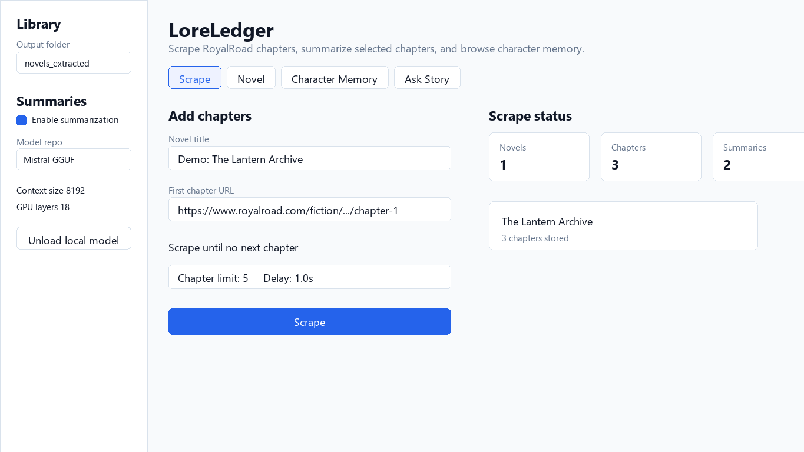
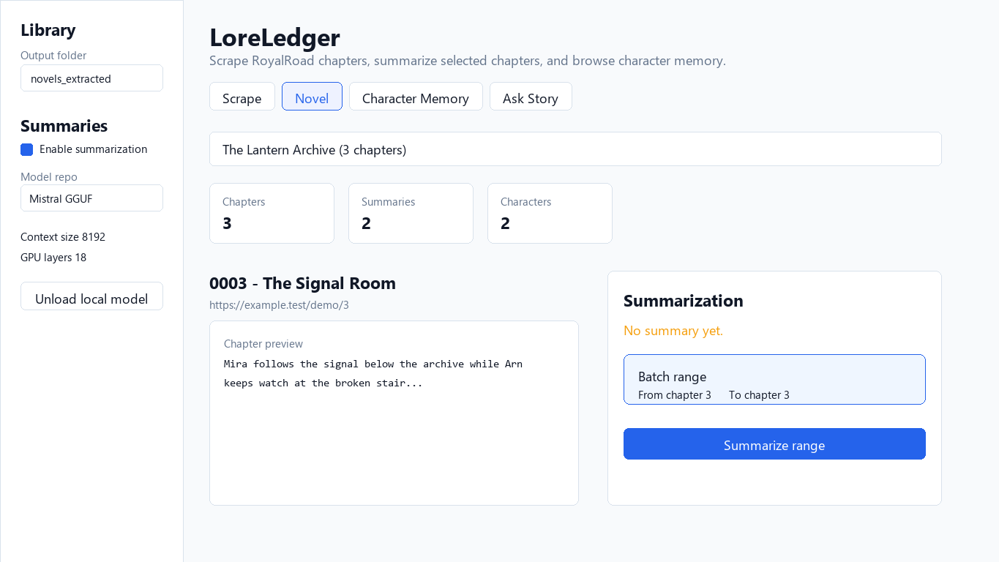
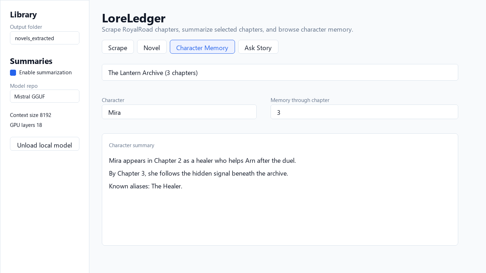
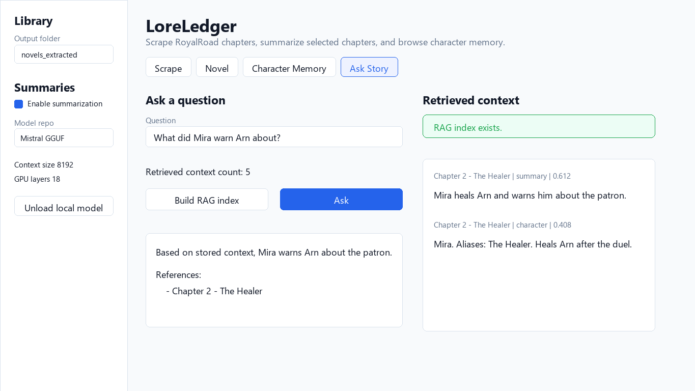

# LoreLedger

LoreLedger is a local-first story memory system for long web novels. It can
scrape chapters, summarize them with a local GGUF model, maintain character
memory over time, and answer grounded questions from the saved story context.

The project is aimed at one practical question: can an AI keep a useful,
continuously updated understanding of a fictional world as it grows across
hundreds or thousands of chapters?

## What It Can Do

- Scrape RoyalRoad chapters into a per-novel local library.
- Store raw chapter text as structured JSON, one file per chapter.
- Summarize chapters with a local `llama.cpp`/GGUF model.
- Run batch summarization from Streamlit with progress and failure status.
- Build character memory timelines from chapter summaries.
- Query what is known about a character up to a selected chapter.
- Build a local RAG index from summaries, character memory, and chapter chunks.
- Ask story questions and get answers with chapter references.
- Use either the Streamlit UI or the `python -m novel_memory` CLI.

## Screenshots

The screenshots below use a small demo story so the README shows the workflow
without exposing long scraped chapter text.









## How It Works

LoreLedger keeps each processing step explicit and reusable:

1. Scrape chapters from RoyalRoad into `novels_extracted/<novel_slug>/chapters/`.
2. Summarize chapters into JSON files under `summaries/`.
3. Extract character updates from summaries and merge them into `characters/`.
4. Build searchable local context in `indexes/rag.json`.
5. Answer questions using retrieved story context and chapter references.

Raw chapter text is kept separate from generated summaries so the memory can be
regenerated later with a better model or different prompt.

## Setup

The project expects Python 3.11.

```powershell
py -3.11 -m venv .venv
.\.venv\Scripts\Activate.ps1
python --version
python -m pip install --upgrade pip
pip install llama-cpp-python==0.3.22 --extra-index-url https://abetlen.github.io/llama-cpp-python/whl/cu124
python -m pip install -r requirements.txt
python -m spacy download en_core_web_sm
```

Copy the example environment file and put your Hugging Face token in `.env`:

```powershell
Copy-Item .env.example .env
notepad .env
```

```env
HF_TOKEN=hf_your_token_here
```

The CLI and Streamlit app load `.env` automatically at startup.

## Streamlit App

Run the local UI:

```powershell
streamlit run streamlit_app.py
```

The Streamlit app has four main tabs:

- `Scrape`: add chapters from a RoyalRoad starting chapter URL.
- `Novel`: preview chapters, summarize one chapter, or summarize a chapter range.
- `Character Memory`: inspect a character timeline through a selected chapter.
- `Ask Story`: build the RAG index, retrieve context, and answer story questions.

Current Streamlit local model defaults are tuned for the current local setup:

```text
Context size: 8192
GPU layers: 18
Temperature: 0.2
```

You can change the model repo, GGUF file pattern, context size, GPU layers, and
temperature from the sidebar before summarizing or asking questions.

## CLI Usage

Scrape a novel:

```powershell
python -m novel_memory scrape --title "Practical Guide To Evil" --start-url "https://www.royalroad.com/fiction/..." --max-chapters 100
```

Verified RoyalRoad titles and first-chapter URLs are available in
`examples/royalroad_stories.json` for quick scraper testing.

Summarize chapters and update character memory:

```powershell
python -m novel_memory summarize --novel practical_guide_to_evil --model-repo TheBloke/Mistral-7B-Instruct-v0.2-GGUF --model-file "*Q4_K_M.gguf" --context-size 8192 --gpu-layers 18
```

Look up what is known about a character by a specific chapter:

```powershell
python -m novel_memory character --novel practical_guide_to_evil --chapter 40 --name "Arn"
```

Build the local RAG index:

```powershell
python -m novel_memory index-rag --novel practical_guide_to_evil --force
```

Ask a grounded story question:

```powershell
python -m novel_memory ask --novel practical_guide_to_evil --question "Who is Arn?" --model-repo TheBloke/Mistral-7B-Instruct-v0.2-GGUF --model-file "*Q4_K_M.gguf" --context-size 8192 --gpu-layers 18
```

Convert older `chapters_1_20.json` batch files into the current per-chapter
layout:

```powershell
python -m novel_memory migrate-batches --novel practical_guide_to_evil --title "Practical Guide To Evil"
```

## Output Layout

All generated story data lives under:

```text
novels_extracted/<novel_slug>/
  metadata.json
  chapters/
    chapter_0001.json
  summaries/
    chapter_0001.json
  characters/
    arn.json
  indexes/
    characters.json
    rag.json
    summarization_job.json
```

`novels_extracted/` is ignored by git because it can contain scraped story text,
generated summaries, and local job status.

## Current Direction

LoreLedger is not meant to be only a chapter summarizer. The roadmap is an
evolving story-memory system with layered memory, character profiles, entity
graphs, wiki-style pages, and stronger long-term retrieval for large fictional
worlds.
